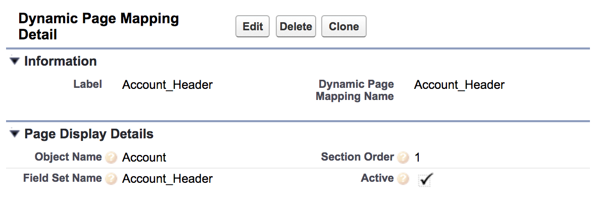

# Building Admin Configurable UIs with React and Visualforce

Custom developed UIs can be a daunting thing to introduce to a client's Salesforce org if the team does not have development resources available to make changes in the future. This can be mitigated upfront by building **configurable UIs** that allow an admin to update the view layer and its components using **clicks not code**. In this example, we'll check out a Visualforce page that serves up a React app, and this React app respects **configurable metadata** within the org.

Here's a quick demo gif that shows this from the admin's perspective.


Our app leverages the standard **field set** and **custom metadata type** options within the Salesforce setup menu, and combines these with the [**Field Set Reactor**](https://github.com/rogeramitchell/FieldSetReactor) repo to describe the metadata in context of the current user. Let's dive in and see how these three components work alongside our client-side React app to create an admin configurable UI.

## Custom Metadata Types: An Alternative to Custom Settings

Custom metadata types were released in Summer '15 as an alternative to custom settings. With these, developers and administrators can deploy the data in each custom metadata type alongside change sets, thus decoupling the potential for data discrepancies between environments as part of releases and sandbox refreshes.



Within the app, we use custom metadata types to define sections of the UI, how these sections interact, and the object/fields that comprise that section. Each record's `DeveloperName` allows us to reference this section within our React app code. The rest of these fields allow admins to control aspects of the UI:

- `Active__c` checkbox allows control of whether to display this section
- `Section_Order__c` defines how sections appear relativr to one another
- `Object_Name__c` specifies the object to which the field set belongs
- `Field_Set_Name__c` binds a field set to this particular section

## Field Sets: Tried and True

Field sets have been around for a while, and are quite easy to implement within a Visualforce page using standard components like `<apex:repeat>`. Another use for field sets is within Apex to control fields used in a query or clone operation. In our app, field sets allow the admin to define the set of fields that should appear in a given section on the UI, and ensures the Apex controller includes those fields when serving data to the UI. Our use of field sets is to allow the admin to control which fields should appear on a per object basis, and for the developer to use these for describing the field attributes and accessibility for the current 
user.

## Field Set Reactor: A Utility to Help SPA Developers

Once we grab the custom metadata types for the current page along with the field sets, we need to describe the fields in context of the current user's access to ensure our UI is flexible and matches the current config. [Field Set Reactor](https://github.com/rogeramitchell/FieldSetReactor) has a method that returns a collection of the `FieldDetails` inner class, which does everything from provide the API name and data type, to the user's read/edit access for the field and the label the user sees in standard pages.

For each field set that appears in the custom metadata types for our page, we get a collection of `FieldDetails` and put this into a map with a key as the custom metadata type's `DeveloperName`.

```java
@RemoteAction
public static Map<String, List<FieldSetReactor.FieldDetails>> getFieldDetails(List<Dynamic_Page_Mapping__mdt> pageMapping)
{
Map<String, List<FieldSetReactor.FieldDetails>> sectionFieldDetails = new Map<String, List<FieldSetReactor.FieldDetails>>();
		
	for(Dynamic_Page_Mapping__mdt pageMap : pageMapping)
	{
		List<FieldSetReactor.FieldDetails> fieldDetails = FieldSetReactor.getFieldDetails(pageMap.Field_Set_Name__c, pageMap.Object_Name__c);
		sectionFieldDetails.put(pageMap.Field_Set_Name__c, fieldDetails);
	}
	
	return sectionFieldDetails;
}
```

## Bundling Together in a Single Package

All of this logic is returned to the Visualforce page as a bundle called `AccountManagementState`, defined within the `AccountManagementController`. This bundle represents not only the sections that comprise the Visualforce page, but also the data that we will pass to each of the sections as `props`. When the page loads, JavaScript remoting calls the `getInitialState` method in `AccountManagementController`, and then the callback parses the response into the React `state`.

Here's what each component of the return value from `getInitialState`:

- `sectionMap`: a collection of our custom metadata type
- `fieldMap`: a map where each key is the custom metadata type records' `DeveloperName`, and value is a collection of `FieldDetails` (from previous section)
- `account`: the Account record with its fields
- `contacts`: a collection of Contacts related to the `account`
- `opps`: a collection of Opportunities related to the `account`

## From the Front End: Integrating with React

Our utility modules and React components exist in `dev/js`, and the topmost component is `App.js`. During the `componentWillMount` lifecycle method, we grab the record ID from the URL, call `setState` to capture the record ID and use the callback to pass `this` to `getInitialState`.

`getInitialState` is imported from `DataHandler.js`, which is a module that contains the interactions between the client and Apex controller; note that the same name for the client side and server side functions is convenient, but not required.

```js
componentWillMount() {
	const recordId = getUrlParameters()["id"];
	this.setState({
		RecordId: recordId
	}, () => {getInitialState(this)});
}
```

Our `getInitialState` method in `DataHandler.js` uses JavaScript remoting to call the `getInitialState` method of the `AccountManagementController` and passes the `RecordId` from state. We use an arrow function as our callback, and break apart the single bundle into different parts of our React `state`, and we pass the relevant structures down to each of our React components within `App.js`.

```jsx
<div className="app-container">
	<AccountHeader 	Fields={this.state.Fields}
									Section={this.state.Sections.get('Account_Header')}
									Account={this.state.Account} />
	<ContactTable 	Fields={this.state.Fields}
									Section={this.state.Sections.get('Contact_Table')}
									Contacts={this.state.Contacts} />
	<OppTable 	Fields={this.state.Fields}
							Section={this.state.Sections.get('Opp_Table')}
							Opps={this.state.Opps} />
</div>
```

Focusing specifically on the `AccountHeader.js` component, we iterate over the array returned from `this.props.Fields.get('Account_Header')` to iteratively create `<AccountHeaderField />` components.

```jsx
<ul className="slds-grid slds-page-header__detail-row">
  {
  	this.props.Fields.get('Account_Header').map(item => 
  		<AccountHeaderField key={item.name} Field={item} Account={this.props.Account} />
		)
  }
</ul>
```

## Dynamic Section Ordering

We had promised the delivery of dynamically ordered sections, and this doesn't require any JS at all. Using exclusively flexbox, we are able to set the `order` property of each top level `<div>` rendered by our `AccountHeader`, `ContactTable`, and `OppTable` components.

Let's check out this example in `AccountHeader`'s render method:
```jsx
if(this.props.Fields.get('Account_Header') != null) {
	let flexOrder = {order: this.props.Section.Section_Order__c};
			
	return(
		<div style={flexOrder} className="slds-page-header">
```
Before returning our JSX, we create an object that contains styles, which includes our `order` property. We pass this as an inline style in the return, and it thus interacts with the other sections based on flexbox's ordering.

Our styles in `dev/css/App.css` are super concise; we want to use flexbox with the primary axis being vertical. The inline styles within each component handle the ordering, and we're done.

```css
div.app-container {
	display: flex;
	flex-direction: column;
}
```

## Ideas for Implementation

While this is a trivial example, there's room to extend this framework further. Here are a few ideas for how you can apply this your development projects and help admins configure their great UIs:

- Bind custom metadata types to specific Record Types for an object
- Define pages that should occur in a multi-step wizard
- Dig further into UI customizations with the [SLDS Grid's Manual Sizing](https://www.lightningdesignsystem.com/components/utilities/grid/#flavor-manual-sizing), allowing admins to control how to display within each section

## Test Driving the App

Head on over to the [GitHub repo](https://github.com/rogeramitchell/dynamically-controlled-vf-react-app) and follow the steps below to try this out in your org:

- Fork the repository and clone to your local machine
- `cd` to your project folder and run `npm install`
- After dependencies have loaded, `webpack --watch` to rebuild your `resource-bundles/AccountManagement.resource/js/app.js` file when components in `dev/` are changed
- Use **Convert to MavensMate Project** feature to deploy this into your org
- Deploy your `AccountManagement.resource` bundle to the server and refresh your `AccountManagement` page

If you've done something similar or want to share your thoughts, feel free to leave a comment below, an issue or PR on the [repo](https://github.com/rogeramitchell/dynamically-controlled-vf-react-app), or via Twitter [@RogerMitchell](https://www.twitter.com/rogermitchell).